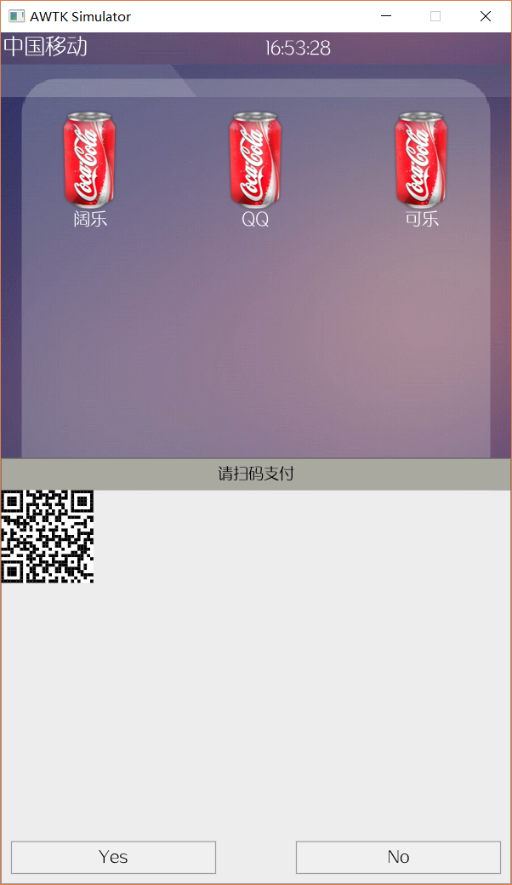
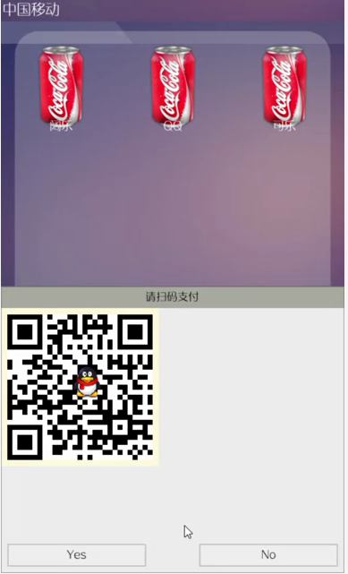
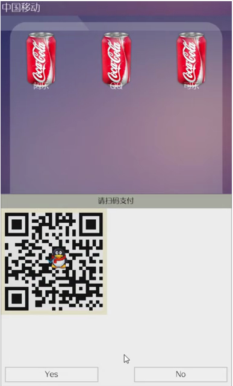

如何扩展AWTK——以二维码控件为例
^^^^^^^^^^^^^^^^^^^^^^^^^^^^^^^

二维码
-----------

二维码又称二维条码，常见的二维码为QR Code，QR全称Quick Response，是一个近几年来移动设备上超流行的一种编码方式，它比传统的Bar Code条形码能存更多的信息，也能表示更多的数据类型。

编写骨架
----------

根据二维码的特点，创建二维码的结构体如下:

.. code-block:: c

    /**
    * @class qr_t
    * @parent widget_t
    * @annotation ["scriptable"]
    * 二维码控件。
    */
    typedef struct _qr_t {
      widget_t widget;
      /**
      * 二维码每个像素在屏幕上的实际像素
      * (取值范围1-8)
      */
      QRcode *qr_code_data;
      /**
      * 二维码每个像素在屏幕上的实际像素
      * (取值范围1-8)
      */
      uint8_t pix_size;
      /**
      * 二维码内容
      */
      char *  qr_text;
      /**
      * 二维码宽度
      */
      uint16_t qr_width;
      /**
      * 二维码状态
      * (是否被扫描)
      */
      bool_t  scaned;
    } qr_t;

.. list-table:: 
  :widths: 8 9 8
  :header-rows: 1

  * - 变量
    - 类型
    - 描述
  * - widget
    - widget_t
    - 窗口基类
  * - qr_code_data
    - QRcode
    - 二维码编码数据
  * - pix_size
    - uint8_t
    - 二维码像素与屏幕像素的转化关系
  * - qr_text
    - char *
    - 二维码的内容
  * - qr_width
    - uint16_t
    - 二维码宽度
  * - scaned
    - bool_t
    - 二维码状态

.. figure:: img/widget_overview.png
    :name:  awtk中继承关系
    :align: center
    :width: 500px

    awtk中继承关系

在AWTK中，所有的控件都要继承widget基类。qr_code_data、pix_size、qr_text、qr_width、scaned这些成员都是根据二维码控件的特点产生的。

对于AWTK来说，一个较为完整的控件总是存在创建方法、销毁方法、参数获取方法、参数设置方法等。

创建控件的方法：

第一步，为控件分配内存。AWTK中，控件所需的内存都动态申请，待控件不再使用时，交由控件销毁的方法回收内存。

第二步，初始化一个窗口实例。调用 **widget_init** 来初始化一个实例，需要注意的是，第三个参数 **const widget_vtable_t* vt** ，这个参数为窗口的虚函数表，将在后面详细讲述。

第三步, 设置一些默认的属性。可以在这里设置二维码控件的一些默认属性，当然这步是可选的。

.. code-block:: c

    widget_t* qr_create(widget_t* parent, xy_t x, xy_t y, wh_t w, wh_t h) {
      qr_t* qr = TKMEM_ZALLOC(qr_t);
      widget_t* widget = WIDGET(qr);
      return_value_if_fail(qr != NULL, NULL);

      widget_init(widget, parent, &s_qr_vtable, x, y, w, h);
      widget->state = WIDGET_STATE_NORMAL;
      /* 默认的二维码像素与屏幕像素的转化关系 */
      qr->pix_size = 1;

      return widget;
    }

销毁控件的方法：

.. code-block:: c

    static ret_t qr_destroy(widget_t* widget) {
      qr_t* qr = QR(widget);
      return RET_OK;
    }

参数设置的方法：

在AWTK中，参数的设置主要通过两种方法。第一种是直接书写API，然后暴露给用户使用。第二种是通过提供 **set_prop** 接口，在该函数里设置想要的参数，上层用过调用 **widget_set_prop** 来设置参数。

对于第一种，主要用于该控件内私有的成员的设置。对于第二种，主要用于需要在 **布局文件** 中单独使用的属性，将在后面详细讲述。

.. code-block:: c

    static ret_t qr_set_prop(widget_t* widget, const char* name, const value_t* v) {
      return_value_if_fail(widget != NULL && name != NULL && v != NULL, RET_BAD_PARAMS);
      qr_t* qr = QR(widget);

      return RET_NOT_FOUND;
    }

参数获取的方法：

在AWTK中，参数的获取主要通过两种方法。第一种是直接书写API，然后暴露给用户使用。第二种是通过提供 **get_prop** 接口，上层用过调用 **widget_get_prop** 来获取参数。

.. code-block:: c

    static ret_t qr_get_prop(widget_t* widget, const char* name, value_t* v) {
      return_value_if_fail(widget != NULL && name != NULL && v != NULL, RET_BAD_PARAMS);
      qr_t* qr = QR(widget);

      return RET_NOT_FOUND;
    }

这个几个常见的方法介绍完了，再来介绍这些方法和上层沟通的桥梁吧!

我们在说到创建控件的方法时，提到了 **const widget_vtable_t* vt**  ，我们来看看这个结构体吧。

.. code-block:: c

    typedef struct _widget_vtable_t {
      uint32_t size;
      const char* type;
      /*克隆widget时需要复制的属性*/
      const char** clone_properties;
      /*持久化widget时需要保存的属性*/
      const char** persistent_properties;
      /**
      * 是否可以滚动。
      */
      uint32_t scrollable : 1;
      /**
      * 是否是窗口。
      */
      uint32_t is_window : 1;
      /**
      * 是否是设计窗口。
      */
      uint32_t is_designing_window : 1;

      widget_create_t create;
      widget_get_prop_t get_prop;
      widget_get_prop_default_value_t get_prop_default_value;
      widget_set_prop_t set_prop;
      widget_on_keyup_t on_keyup;
      widget_on_keydown_t on_keydown;
      widget_on_paint_background_t on_paint_background;
      widget_on_paint_self_t on_paint_self;
      widget_on_paint_children_t on_paint_children;
      widget_on_paint_border_t on_paint_border;
      widget_on_paint_begin_t on_paint_begin;
      widget_on_paint_end_t on_paint_end;
      widget_on_pointer_down_t on_pointer_down;
      widget_on_pointer_move_t on_pointer_move;
      widget_on_pointer_up_t on_pointer_up;
      widget_on_layout_children_t on_layout_children;
      widget_invalidate_t invalidate;
      widget_on_add_child_t on_add_child;
      widget_on_remove_child_t on_remove_child;
      widget_on_event_t on_event;
      widget_find_target_t find_target;
      widget_recycle_t recycle;
      widget_destroy_t destroy;
    } widget_vtable_t;

这个结构体中定义了很多的方法，在 `awtk/src/base/widget.c <../../awtk/src/base/widget.c>`_ 有这些方法的默认实现，我们只需要重写这些方法，就可以来实现我们想要控件绘制。

.. code-block:: c

    static const char* s_qr_properties[] = {WIDGET_PROP_REPEAT, NULL};
    static const widget_vtable_t s_qr_vtable = {.size = sizeof(qr_t),
                                                    .type = WIDGET_TYPE_QR,
                                                    .create = qr_create,
                                                    .clone_properties = s_qr_properties,
                                                    .persistent_properties = s_qr_properties,
                                                    .on_event = qr_on_event,
                                                    .set_prop = qr_set_prop,
                                                    .get_prop = qr_get_prop,
                                                    .destroy = qr_destroy,
                                                    .on_paint_begin = qr_on_paint_begin,
                                                    .on_paint_end   = qr_on_paint_end,
                                                    .on_paint_background = qr_on_paint_background,
                                                    .on_paint_border = qr_on_paint_border,
                                                    .on_paint_self = qr_on_paint_self};

我们只要在初始化这个窗口实例的时候，将我们重写的方法传入，上层在绘制该控件的时候，就会调用我们提供的方法来绘制该控件。

这样，我们就得到了一个基本的控件的样子了。

下面我们将介绍如何来填充实际的绘制方法。

填充内容
----------

在编写实际的绘制函数之前，我们先来介绍一些常用的绘制方法吧!

.. list-table:: 常用的绘制方法
  :widths: 8 9 8
  :header-rows: 1

  * - 方法名
    - 类
    - 描述
  * - on_paint_begin 
    - widget_vtable_t 
    - 绘制开始
  * - on_paint_end
    - widget_vtable_t
    - 绘制结束
  * - on_paint_background
    - widget_vtable_t
    - 绘制背景
  * - on_paint_self
    - widget_vtable_t
    - 绘制自身
  * - on_paint_children
    - widget_vtable_t
    - 绘制子控件
  * - on_paint_border
    - widget_vtable_t
    - 绘制边框

在AWTK中，控件的绘制顺序遵循顺序为: background->self->children->border->end

.. code-block:: c

    canvas_translate(c, ox, oy);
    widget_on_paint_begin(widget, c);
    widget_on_paint_background(widget, c);
    widget_on_paint_self(widget, c);
    widget_on_paint_children(widget, c);
    widget_on_paint_border(widget, c);
    widget_on_paint_end(widget, c);
    canvas_untranslate(c, ox, oy);

现在，我们将二维码编码库加入到我们的工程中，这个过程就不详细介绍了。

根据上面的绘制顺序，在绘制二维码控件的时候，先调用 **on_paint_begin** 方法。所以在该方法里面做二维码的编码工作。

.. code-block:: c

    static ret_t qr_on_paint_begin(widget_t* widget, canvas_t* c) {
      qr_t* qr = QR(widget);
      if (qr->qr_text != NULL) {
        QRcode *qr_code;
        qr_code = QRcode_encodeString((const char *)qr->qr_text, 3, QR_ECLEVEL_H, QR_MODE_8, 1);
        qr->qr_code_data = qr_code;
        qr->qr_width = qr_code->width;
      }
      return RET_OK;
    }

在该方法中，我们首先判断是否设置了我们要编码的内容，然后调用二维码编码的方法。

当绘制二维码控件结束的时候，会调用  **on_paint_end** 方法，所以在该方法内做一些清理工作。

.. code-block:: c

    static ret_t qr_on_paint_end(widget_t* widget, canvas_t* c) {
      qr_t* qr = QR(widget);
      if (qr->qr_code_data != NULL) {
        QRcode_free(qr->qr_code_data);
        qr->qr_code_data = NULL;
      }

      return RET_OK;
    }

在调用该方法时，我们的二维码实际上已经绘制完成了(还未刷新)，所以二维码的数据就没有必要再保存了，所以释放二维码编码的数据。

接下来我们看如何绘制二维码。

.. code-block:: c

    static ret_t qr_on_paint_self(widget_t* widget, canvas_t* c) {
      qr_t* qr = QR(widget);
      if (qr->qr_text != NULL) {
        QRcode *qr_code;
        int y = 0, x = 0, a = 0, b = 0;
        qr_code = qr->qr_code_data;
        if (qr->scaned == FALSE) {
          for(y = 0; y < qr_code->width; y++) {
            for(x = 0; x < qr_code->width; x++) {
              if(qr_code->data[y * qr_code->width + x] & 0x01)  {
                /* 画黑色矩形 */
                canvas_set_fill_color(c, color_init(0x00, 0x00, 0x00, 0xff));
              } else {
                /* 画白色矩形 */
                canvas_set_fill_color(c, color_init(0xff, 0xff, 0xff, 0xff));   
              }
              canvas_fill_rect(c, x * qr->pix_size, y * qr->pix_size, qr->pix_size, qr->pix_size);
            }
          }
        }
      }

      return widget_paint_helper(widget, c, NULL, NULL);
    }

我们可以看出，这个绘制其实很简单的，我们只需要获取编码之后的数据，然后扫描该数据，发现是1的点画黑色矩形，0的点画白色矩形，这个就是绘制二维码的要点。
当然实际上，假如我们在像素密度较高的屏幕上时，就会发现我们的二维码难以扫描。所以，我们给二维码加入一个“缩放”数据，也就是二维码像素与屏幕像素的映射关系-pix_size。

有了以上的代码，我们就可以显示二维码了。

测试1
-----------

现在，我们来测试一下我们写的二维码控件。

.. code-block:: c

    widget_t *qr_dialog = widget_lookup(sale_ok, "qr_dialog", TRUE);

    widget_t *new_qr_code = qr_create(qr_dialog, 0, 0, 0, 0);
    qr_set_pixsize(new_qr_code, 3);
    qr_set_text(new_qr_code, "致远电子");
    widget_set_self_layout_params(new_qr_code, "0", "30", "100%", "100%");
    widget_set_name(new_qr_code, "new_qr_code");

.. _run:

    测试1运行图

细心的读者可能发现，我们现在的二维码控件是使用代码创建的，那么能否使用UI描述文件生成呢？

当然是可以的!

使用UI描述文件生成控件
-------------------------

AWTK的一大特色就是支持UI描述文件，这个是emwin所没有的。那么AWTK是如何实现的呢？

以下面的这个UI描述文件为例，看AWTK如何将UI描述文件绘制出图形。

.. code-block:: xml

    <dialog anim_hint="bottom_to_top" x="0" y="bottom" w="100%" h="50%">
      <dialog_title x="0" y="0" w="100%" h="30" text="请扫码支付" />
      <dialog_client name="qr_dialog" x="0" y="bottom" w="100%" h="-30" layout="r1 c0 m20">
        <qr name="qr_code" style="qr_border" x="c" y="0" w="100%" h="100%" text="致远" pix_size="3"/>
      </dialog_client>
    </dialog>

首先，AWTK通过 **window_open** 打开我们的UI描述文件，其调用关系为:
window_open->window_open_impl->ui_loader_load->ui_loader_load_default，
在 **ui_loader_load_default** 解析UI描述文件，首先，解析出XML文件的根元素 **dialog**，
然后通过查表--- **static const creator_item_t s_builtin_creators[]** 位于 `src/base/widget_factory.c <../../awtk/src/base/widget_factory.c>`_ ,
发现了 **dialog** 具有一个构建函数，表明这个 **dialog** 是AWTK的一个控件，然后解析根元素的属性，根元素的属性本质上是键值对。
在上一步中，AWTK已经创建了该 **dialog** 控件，已经有一个 **dialog** 的实例，所以这个时候可以调用 **dialog** 的 **set_prop**
方法将该属性设置到 **dialog** 控件。

.. code-block:: c

    ret_t ui_loader_load_default(ui_loader_t* loader, const uint8_t* data, uint32_t size,
                                ui_builder_t* b) {
    rbuffer_t rbuffer;
    widget_desc_t desc;
    uint32_t magic = 0;
    uint8_t widget_end_mark = 0;

    return_value_if_fail(loader != NULL && data != NULL && b != NULL, RET_BAD_PARAMS);
    return_value_if_fail(rbuffer_init(&rbuffer, data, size) != NULL, RET_BAD_PARAMS);
    return_value_if_fail(rbuffer_read_uint32(&rbuffer, &magic) == RET_OK, RET_BAD_PARAMS);
    return_value_if_fail(magic == UI_DATA_MAGIC, RET_BAD_PARAMS);

    ui_builder_on_start(b);
    while (rbuffer_has_more(&rbuffer)) {
        const char* key = NULL;
        const char* value = NULL;
        return_value_if_fail(rbuffer_read_binary(&rbuffer, &desc, sizeof(desc)) == RET_OK,
                            RET_BAD_PARAMS);
        ui_builder_on_widget_start(b, &desc);

        return_value_if_fail(rbuffer_read_string(&rbuffer, &key) == RET_OK, RET_BAD_PARAMS);
        while (*key) {
        return_value_if_fail(rbuffer_read_string(&rbuffer, &value) == RET_OK, RET_BAD_PARAMS);
        ui_builder_on_widget_prop(b, key, value);
        return_value_if_fail(rbuffer_read_string(&rbuffer, &key) == RET_OK, RET_BAD_PARAMS);
        }
        ui_builder_on_widget_prop_end(b);

        if (rbuffer_has_more(&rbuffer)) {
        return_value_if_fail(rbuffer_peek_uint8(&rbuffer, &widget_end_mark) == RET_OK,
                            RET_BAD_PARAMS);
        while (widget_end_mark == 0) {
            rbuffer_read_uint8(&rbuffer, &widget_end_mark);
            ui_builder_on_widget_end(b);
            if ((rbuffer.cursor + 1) >= rbuffer.capacity ||
                rbuffer_peek_uint8(&rbuffer, &widget_end_mark) != RET_OK) {
            break;
            }
        }
        }
    }
    ui_builder_on_end(b);

    return RET_OK;
    }

同样，AWTK会递归解析子元素，然后构建控件，调用 **set_prop** 方法设置属性。

所以，要让AWTK支持我们的二维码控件，通过布局文件创建，只需要在 **s_builtin_creators** 加入我们的构建函数。

.. code-block:: c

    static const creator_item_t s_builtin_creators[] = {
        {WIDGET_TYPE_DIALOG, dialog_create},
        {WIDGET_TYPE_DIALOG_TITLE, dialog_title_create},
        {WIDGET_TYPE_DIALOG_CLIENT, dialog_client_create},
        .........
        {WIDGET_TYPE_QR, qr_create}};

上面通过静态来创建，我们也可以使用动态来注册，位于 **src/ext_widgets/ext_widgets.c**。
对于AWTK的插件来说，是不能改动核心源码的，多以采用动态注册的方式来扩展。

.. code-block:: c

    ......

    widget_factory_register(widget_factory(), WIDGET_TYPE_QR, qr_create);

    ......

然后再重写二维码控件的 **set_prop** 方法。

.. code-block:: c

    static ret_t qr_set_prop(widget_t* widget, const char* name, const value_t* v) {
      return_value_if_fail(widget != NULL && name != NULL && v != NULL, RET_BAD_PARAMS);
      qr_t* qr = QR(widget);
      log_debug("name:%s value:%d\r\n", name, value_int(v));

      if (tk_str_eq(name, WIDGET_PROP_PIX_SIZE)) {
        return qr_set_pixsize(widget, value_int(v));
      } else if (tk_str_eq(name, WIDGET_PROP_TEXT)) {
        return qr_set_text(widget, value_str(v));
      }

      return RET_NOT_FOUND;
    }

.. code-block:: c

    ......

    /**
    * @const WIDGET_PROP_PIX_SIZE
    * 二维码像素映射关系
    */
    #define WIDGET_PROP_PIX_SIZE "pix_size"

    ......

注册了构建函数和重写了 **set_prop** 方法后，AWTK就可以正确的从布局文件中加载我们自己写的二维码控件了。

实际的二维码大多是有边框、有些二维码被扫描后，还能展现出被扫描的状态。

下一节我们将介绍如何让AWTK支持样式文件。

让控件炫彩-支持样式表
>>>>>>>>>>>>>>>>>>>>>>>>>>

我们可以通过设置样式文件来让我们的二维码控件变得更炫。以下列的样式文件来说明二维码控件如何支持样式表。

.. code-block:: xml

    <qr>
      
    </qr>

首先重写二维码控件的 **on_paint_border** 方法。

.. code-block:: c

    static ret_t qr_on_paint_border(widget_t* widget, canvas_t* c) {
      qr_t* qr = QR(widget);

      color_t trans = color_init(0, 0, 0, 0);
      style_t* style = widget->astyle;
      int32_t margin = style_get_int(style, STYLE_ID_MARGIN, 2);
      color_t margin_color = style_get_color(style, STYLE_ID_MARGIN_COLOR, trans);
      const char* logo_image_name = style_get_str(style, STYLE_ID_FG_IMAGE, NULL);
      bitmap_t img;
      rect_t r;
      
      QRcode *qr_code;
      qr_code = qr->qr_code_data;

      /* 边框颜色 */
      if (margin > 0) {
        /* 根据style 设置边框颜色 */
        canvas_set_fill_color(c, margin_color);   
        /* 上 */
        canvas_fill_rect(c, w + 0, h + 0, margin + qr_code->width * qr->pix_size, margin);
        /* 右 */  
        canvas_fill_rect(c, w + margin + qr_code->width * qr->pix_size, h + 0, margin, margin + qr_code->width * qr->pix_size);  
        /* 下 */  
        canvas_fill_rect(c, w + margin, h + margin + qr_code->width * qr->pix_size, margin + qr_code->width * qr->pix_size, margin); 
        /* 左 */  
        canvas_fill_rect(c, w + 0, h + margin, margin, margin + qr_code->width * qr->pix_size); 
      }

      /* 二维码的logo图片 */
      r = rect_init(0 + margin + (qr_code->width / 5) * 2.5 * qr->pix_size , 0 + margin + (qr_code->width / 5) * 2 * qr->pix_size, (qr_code->width / 4) * qr->pix_size, (qr_code->width / 4) * qr->pix_size);
      if (logo_image_name && widget_load_image(widget, logo_image_name, &img) == RET_OK) {
        canvas_draw_image_ex(c, &img, IMAGE_DRAW_SCALE, &r);
      }

      if (widget->state == WIDGET_STATE_SCANED){
        color_t dimgrey = color_init(0X69, 0X69, 0X69, 50);
        style_t* style = widget->astyle;
        int32_t margin = style_get_int(style, STYLE_ID_MARGIN, 2);
        const char* check_image_name = style_get_str(style, STYLE_ID_BG_IMAGE, NULL);
        bitmap_t img;
        rect_t r;

        /* 设置标志图片 */
        r = rect_init(0, 0, margin + qr->qr_width * qr->pix_size, margin + qr->qr_width * qr->pix_size);
        canvas_set_fill_color(c, dimgrey);   
        canvas_fill_rect(c, 0, 0, margin * 2 + qr->qr_width * qr->pix_size, margin * 2 + qr->qr_width * qr->pix_size); 
        if (check_image_name && widget_load_image(widget, check_image_name, &img) == RET_OK) {
          canvas_draw_image_ex(c, &img, IMAGE_DRAW_ICON, &r);
        }
      }
      return RET_OK;
    }

在 **on_paint_border** 的方法中，先拿到了二维码控件的 **style** ，分别通过 **style_get_xx** 来获取我们想要的参数。

.. code-block:: c

  style_t* style = widget->astyle;
  int32_t margin = style_get_int(style, STYLE_ID_MARGIN, 2);
  color_t margin_color = style_get_color(style, STYLE_ID_MARGIN_COLOR, trans);
  const char* logo_image_name = style_get_str(style, STYLE_ID_FG_IMAGE, NULL);

对于二维码控件被扫描的状态改变，可以用 **WIDGET_STATE_SCANED**，表示。

然后在我们的 **on_paint_border** 的方法中，检测二维码控件的的状态是否为 **WIDGET_STATE_SCANED**，然后将背景二维码的
背景变暗，同时加上被扫描之后的图标。

这样，我们只需要调用 **widget_set_state(qr_code, WIDGET_STATE_SCANED);** ，二维码控件就能改变状态了。

.. _normal:

    二维码状态正常

.. _scand:

    二维码被扫描

总结
--------------

得益于AWTK的优秀架构，可以很方便的来扩展出一些没有的插件，只需要关注几个重要的方法，就可以完成一些插件了。
